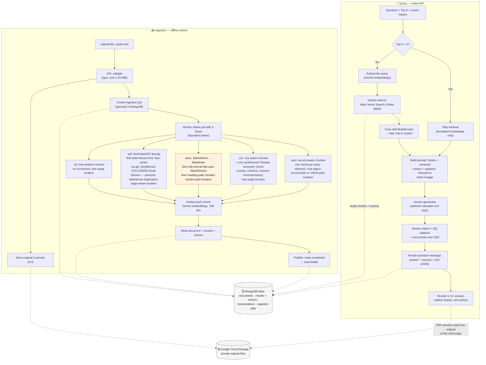

# RAG System Data Flow

The technical mechanics, split into the two phases that share MongoDB. **Ingestion** runs
offline in the worker and turns a document into searchable, embedded chunks. **Query** runs
online in the API: it retrieves the most relevant chunks with hybrid search, builds a
prompt, and streams a cited answer from Gemini.

Ingestion is **not** a single universal pipeline — each file extension is dispatched to
its own extractor (`app/extraction.py:extract()`). Only `.docx` is converted with
MarkItDown; `.pdf` is parsed directly with fitz/PyMuPDF (never MarkItDown, to keep page
boundaries and avoid re-emitting table text as prose), and `.txt`/`.csv`/`.json` use their
own custom chunkers with no conversion step at all.

