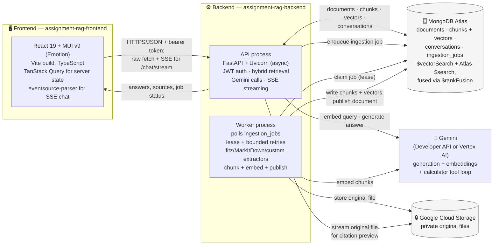

# System Architecture

The two independently deployed applications, the two backend processes that share
MongoDB, and the external services they call. Tech stack labels are pulled directly from
`package.json` and `pyproject.toml`.

- **Two processes, one database.** The API and the worker are separate OS processes
  that never call each other directly — they coordinate only through MongoDB
  (`ingestion_jobs` as the queue). The Docker image runs both in one container for the
  POC; a real deployment would run them as separate services.
- **MarkItDown is not on the request path for every format** — only the worker's `.docx`
  branch uses it (see `diagram-rag-data-flow.md`). `.pdf` uses fitz/PyMuPDF directly.
- **Gemini is called from both processes**: the worker for embeddings during ingestion,
  the API for query embeddings, answer generation, and the calculator tool loop.
