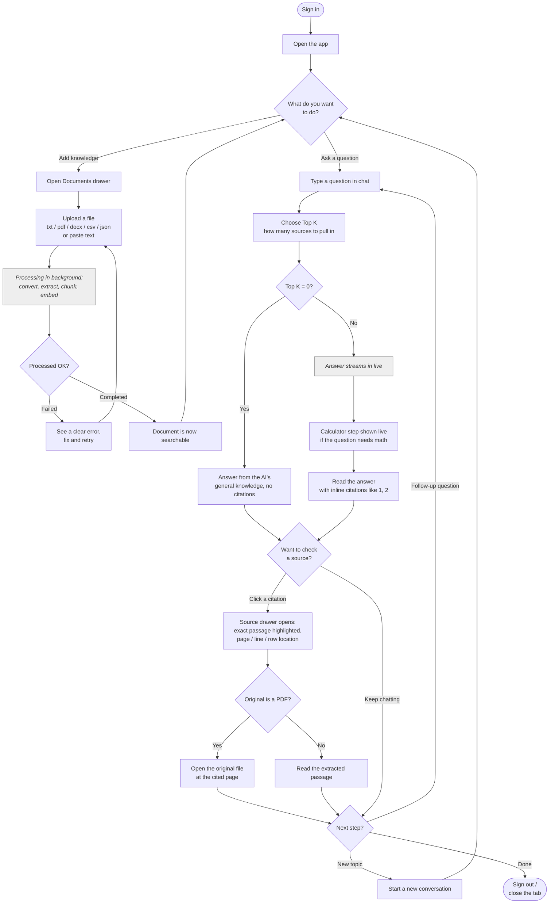

# User Journey — Knowledge Assistant

How one admin user goes from signing in to reading a cited, inspectable answer. The two
grey "wait" points are the only places the user pauses: while a document is processed in
the background, and while the answer streams in live.

